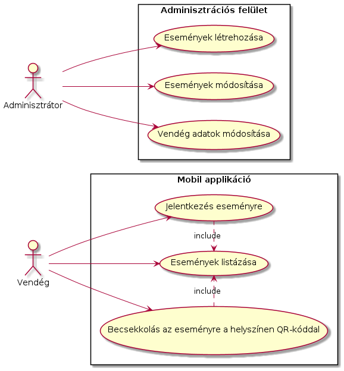
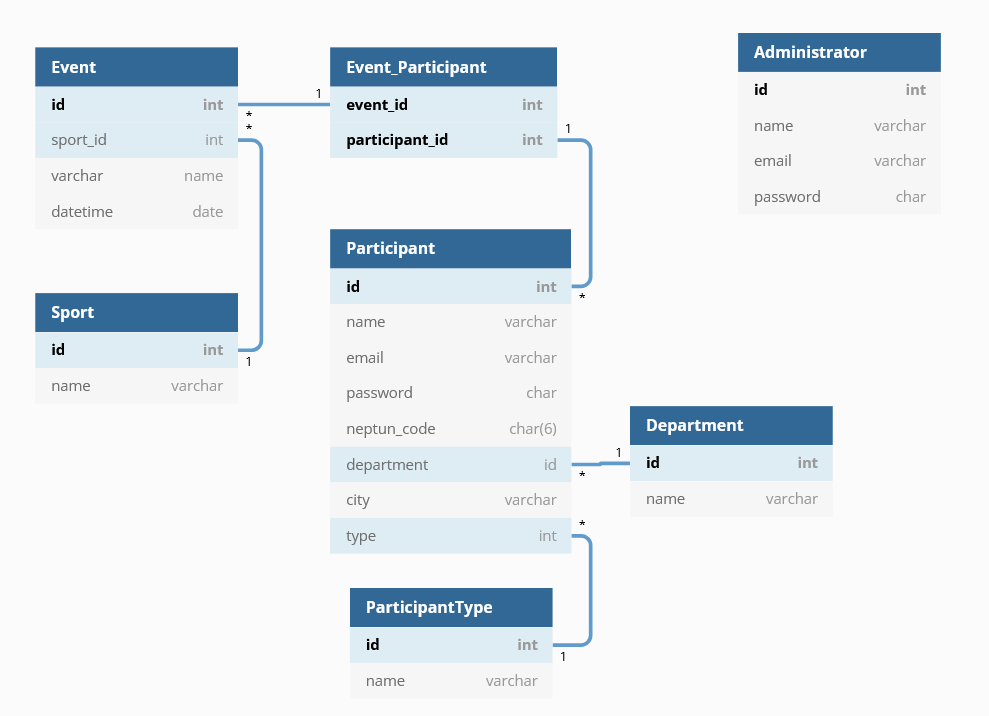

# Rendszerterv

## A rendszer célja
A rendszer célja, hogy megkönnyítse a sportrendezvényekre való regisztrációt a résztvevők és adminisztrátorok számára egyaránt. Kiváltja a papír alapú adminisztrációt, ezáltal sokkal környezetkímélőbb megoldást biztosít. A költségeket és az adminisztrációhoz szükséges időt csökkenti.
A vendégek ingyenesen elérhető mobil applikáción keresztül mindössze egy QR kód beolvasásával tudjanak az eseményre becsekkolni.
Az admisztrátorok egyszerűen tudjanak adatokat kezelni, módosítani.
## Projektterv

### Szerepkörök

Back-end fejlesztők:
- Csicsman Dominika
- D.Tóth Bátor
- Árvai Dániel

Front-end fejlesztők:
- Árvai Dániel
- D.Tóth Bátor

### Ütemterv
| Funkció / Story | Feladat / Task| Prioritás| Becslés | Aktuális becslés|Eltelt idő|Hátralévő idő|
|---|---|---|---|---|---|---|
| Követelmény specifikáció||0|7|7|7|0|
| Funkcionális specifikáció||0|7|7|7|0|
| Rendszerterv||0|7|7|7|0|
| Adattárolás|Adatmodell megtervezése|0|4|4|0|4|
| |Adatbázis megvalósítása a szerveren|1|2|2|0|2|
| Rendszer alapja | REST API megvalósítása | 1 | 18 | 18 | 0 | 18 |
| Adminisztrációs felület | Felület megtervezése | 2 | 7 | 7 | 1 | 6 |
| | Megvalósítás | 2 | 14 | 14 | 0 | 14 |
| Mobil alkalmazás (iOS) | Felület megtervezése | 3 | 7 | 7 | 6 | 1 |
| | Megvalósítás | 3 | 14 | 14 | 0 | 14 |
| Mobil alkalmazás (Android) | Felület megtervezése | 3 | 7 | 7 | 6 | 1 |
| | Megvalósítás | 3 | 14 | 14 | 0 | 14 |
## Üzleti folyamatok modellje

A személyek kik még nincsenek beregiszrálva a weboldalra azok elősször be kell regisztrálnia. Ez után ha a **Vendég** (akár hallgató, dolgozó vagy külsős) annak lehetősége lesz az adott időszakban meghírdetett rendezvényekre való regisztrációra és helyileg egy QR-kód beolvasásával igazolni a megjelenését. Míg ha **Admin** jelentkezet be akkor az egyén újjabb rendezvényeket írhat ki, meglévők adatait módosíthatja vagy törölheti a rendezvényt, az érdeklődők számát megtekintheti és exportálhatja a rendezvény adatait (xlsx, csv). A vendégek adatait módosíthatja.

## Követelmények

| MODUL | ID | NÉV	| V. | LEÍRÁS |
|--|--|--|--|--|
| Jogosultság | K1 | Regisztráció | 1.0 | A felhasználó 3 opció alapján regisztrálhat, (hallgató, dolgozó, külsős). Ezek alapján kell megadni az adatait. **Hallgató:** név, neptun kód, email cím. **Dolgozó:** név, email cím, szervezeti egység. **Külsős:** név, email cím, lakóhely. Mindegyik esetben kell megadni egy jelszót is, mely tárolása kódolva történik az adatbázisban. Hibásan bevitt adatok esetén hibaüzenetet kap a felhasználó (pl.: a követelményeknek nem megfelelő jelszó.)  |
| Jogosultság | K2 | Bejelentkezési felület | 1.0 | A felhasználó e-mail cím és jelszó segítségével bejelentkezhet, mely, ha nem megfelelő, akkor hibaüzentet kap. |
| Jogosultság | K3 | Jogosultsági szintek | 1.0 | **Adminisztrátor:** QR-kód létrehozása eseményekhez. Adatok importálása. **Vendég:** Az esemény adatinak lekérdezése és QR kódok beolvasása illetve létrehozása jegyként. |
| Jogosultság | K4 | Adminisztrációs felület | 1.0 | Az adminisztrátoroknak fenntartott felület, ahonnan ki tudják importálni az adatokat és QR kódokat generálni az eseményekhez. |
| Felület | K5 | Események | 1.0 | Felsorolva kell megjelennie az összes esemény nevének és időpontjának |
| Felület | K6 | Egy esemény részletei | 1.0 | Az esemény pontos adatainak megjelenítése (dátum, időtartam, helyszín stb.) és beolvasás fül megjelenítése. |
| Felület | K7 | Esemény QR kód beolvasásának visszaigazolása | 1.0 | Egy visszaigazoló felület, amely megköszönni a részvételt és jó szórakozást kíván az eseményhez |
| Statisztika | K8 | Résztvevők adatai | 1.0 | Könnyen kinyerhető vendég adatok. Ezeknek importálása Excel táblázat kezelő által használt formátumba (xlsx stb.). |
| Modifikáció | K9 | Vendég adatmódosítás | 1.0 | A vendég az adminisztrátorhoz tud fordulni, bármilyen adatmódosítási kéréssel.  |

## Funkcionális terv
A rendszerben két szerepkört különböztetünk meg: Admin és Vendég.

### Admin
- Új rendezvényt írhat ki
- Meglévő rendezvény adatait módosíthatja
- Meglévő rendezvényt törölhet
- Vendég adatait/jelszavát módosíthatja
- Exportálhatja a rendezvény adatokat (xlsx, csv)

### Vendég
- Regisztrálhat hallgatóként, dolgozóként vagy külsős vendégként
- Megtekintheti az aktuális időszakban meghirdetett rendezvények listáját
- QR-kódot beolvasva a helyszínen, jelezheti, hogy megjelent

## Fizikai környezet
Az alkalmazás Android, iOS és web platformra készül. Használatához internetkapcsolat szükséges.
A mobil alkalmazás QR-kód funkciója csak kamerával működik.

### Fejlesztői eszközök
| Név                | Típus                           |
| ------------------ | ------------------------------- |
| Visual Studio Code | fejlesztőkörnyezet              |
| Docker             | konténerizációs platform        |
| Postman            | REST kliens                     |
| React JS           | webes keretrendszer             |
| React Native       | mobil keretrendszer             |
| Bootstrap          | CSS keretrendszer               |
| PHPMyAdmin         | adatbázis kliens                |
| JetBrains DataGrip | adatbázis kliens                |
| Figma              | web- és mobil design szerkesztő |

## Architekturális terv

### Backend
A rendszerhez szükség van egy adatbázis szerverre, jelen esetben a MySQL-t használjuk.
A kliens oldali programokat egy PHP alapú REST API szolgálja ki, ez csatlakozik az adatbázis szerverhez.
A kliensekkel JSON objektumokkal kommunikál.

#### REST végpontok
| Erőforrás         | Method   | URL                | Eljárás                 |
| ----------------- | -------- | ------------------ | ----------------------- |
| Rendezvény        | `GET`    | `/events`          | Összes lekérdezése      |
| Rendezvény        | `GET`    | `/events/{id}`     | Lekérdezés azonosítóval |
| Rendezvény        | `POST`   | `/events`          | Új létrehozása          |
| Rendezvény        | `PUT`    | `/events/{id}`     | Módosítás               |
| Rendezvény        | `DELETE` | `/events/{id}`     | Törlés                  |
| Sportág           | `GET`    | `/sports`          | Összes lekérdezése      |
| Sportág           | `GET`    | `/sports/{id}`     | Lekérdezés azonosítóval |
| Sportág           | `POST`   | `/sports`          | Új létrehozása          |
| Sportág           | `PUT`    | `/sports/{id}`     | Módosítás               |
| Sportág           | `DELETE` | `/sports/{id}`     | Törlés                  |
| Vendég            | `GET`    | `/guests`          | Összes lekérdezése      |
| Vendég            | `GET`    | `/guests/{id}`     | Lekérdezés azonosítóval |
| Vendég            | `POST`   | `/guests`          | Új létrehozása          |
| Vendég            | `PUT`    | `/guests/{id}`     | Módosítás               |
| Vendég            | `DELETE` | `/guests/{id}`     | Törlés                  |
| Vendég típus      | `GET`    | `/guest_types`     | Összes lekérdezése      |
| Intézményi egység | `GET`    | `/department`      | Összes lekérdezése      |
| Intézményi egység | `GET`    | `/department/{id}` | Lekérdezés azonosítóval |
| Intézményi egység | `POST`   | `/department`      | Új létrehozása          |
| Intézményi egység | `PUT`    | `/department/{id}` | Módosítás               |
| Intézményi egység | `DELETE` | `/department/{id}` | Törlés                  |

### Adminisztrációs oldal
A web alkalmazás React JS keretrendszer használatával készül el.

### Mobil alkalmazás
A mobil applikáció React Native keretrendszer használatával készül el, így egyetlen alkalmazás kiadható Androidra és iOS-re is.

## Adatbázis terv

## Implementációs terv
Az adminisztrációs felület egy React JS alapú webalkalmazás lesz, amelyhez a Bootstrap nevű CSS keretrendszert is felhasználjuk. Az alkalmazás a Back-end részen futó REST szolgáltatás metódusait használja fel.

Az mobil alkalmazás a React Native keretrendszert használja, melyet Android és iOS operációs rendszerekre egyaránt kiadhatunk, így nem szükséges 2 különböző applikációt fejleszteni. Az alkalmazás a Back-end részen futó REST szolgáltatás metódusait használja fel.

## Tesztterv
A projekt elkészítése során folyamatos tesztelésre van szükség, melynek célja a rendszer és komponensei funkcionalitásának teljes vizsgálata, ellenőrzése.
Tesztelni kell a back-end részt, az adminisztrátori funkciók és a két mobil applikáció működését. 
Tesztelni kell a dizájn minden elemét.
Tesztelni kell az adatbázis megfelelő működését, értjük ez alatt az adatok helyes tárolását stb.

Alfa teszt: Meglévő funkcióknak a különböző böngészőkkel való kompatibilitásának tesztelése. Mobil appok tesztelése. A tesztet a fejlesztők végzik.

Béta teszt: Ezt a tesztet nem a fejlesztők végzik. Böngészőkkel való kompatibilitásának tesztelése. Mobil appok tesztelése.
## Telepítési terv

### Back-end
A back-endhez Docker Image is készül, így az egyszerűen telepíthető felhő alapú tárhely szolgáltatóra az image feltöltésével.

Ennek mellőzése esetén, szükség lesz egy adatbázis szerverre, melyen MySQL 8.0 fut. Ezen létrehozzuk az alkalmazáshoz tartozó adatbázist, és a hozzá tartozó táblákat.
Telepítünk egy szervert, melyen PHP 8.0-t és Apache webszervert konfigurálunk, és környezeti változókon keresztül beállítjuk az adatbázis-hozzáférést.
Végül a program PHP kódját az Apache szerver webtárhely könyvtárába (pl. `/var/www/` vagy `/var/www/html`) másoljuk, majd az Apache szolgáltatást újrainditjuk.

### Webes alkalmazás
A webapplikáció telepítésének előfeltétele a Node.js telepítése, amit pl. Ubuntu Serveren az `apt install nodejs` paranccsal tehetünk meg.
Az alkalmazás forráskódját elhelyezzük a szerveren egy tetszőleges könyvtárba, majd abban a könyvtárban kiadjuk az `npm install` parancsot, majd az `npm start` paranccsal elindítjuk a Node szervert.

### Mobil alkalmazás
A felhasználók számára az alkalmazás a Play Store-ból (Android), illetve az App Store-ból (iOS) ingyenesen letölthető lesz. Egyszerűen megkeresik az alkalmazás oldalát a telefonjuk operációs rendszéhez tartozó szoftveráruházban, és a "Telepítés" gombra kattintva installálják az applikációt.

A fejlesztés során az APK fájlt az Android Developer Kit segítségével telepítjük a teszt eszközre.

## Karbantartási terv
Az alkalmazás üzelmetétese és karbantartása magába foglalja a programhibák elhárítását. Az alkalmazás bővítési lehetőségét fenntartjuk. Belső illetve egyéb igények, környezeti feltételek változása esetén kiterjed a program- és állomány modosításra is.
Mobil alkalmazásainkat ellenőrizni kell, hogy az aktuális Android illet iOS verziókkal kompatibilisek legyenek.
Mivel a weboldal teljesen alapjaiból felépített webhely ezért a felhasználók által küldött visszajelzésekre majd külön helyet tartunk fent az oldalon. Ezt az oldalon megtalálható e-mail címen keresztül fogja a weboldal üzemeltetője megkapni.
